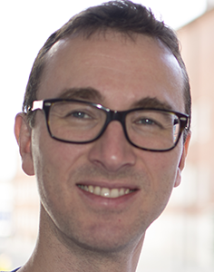

## Bio

Ulrik Sartipy is a cardiac surgeon at the Heart and Vascular Theme, [Karolinska University Hospital](http://www.karolinska.se) and an associate professor (docent) at the Department of Molecular Medicine and Surgery, [Karolinska Institutet](http://www.ki.se), Stockholm, SWEDEN.

His research interests include heart disease and clinical epidemiology.

More interesting stuff will be added ....

## More information

- [Selected publications](https://ulriksartipy.github.io/selected_publ)

- [Research_web](https://ulriksartipy.rbind.io) -- work in progress!!

- [Publication list](publications/publication_list.md)
